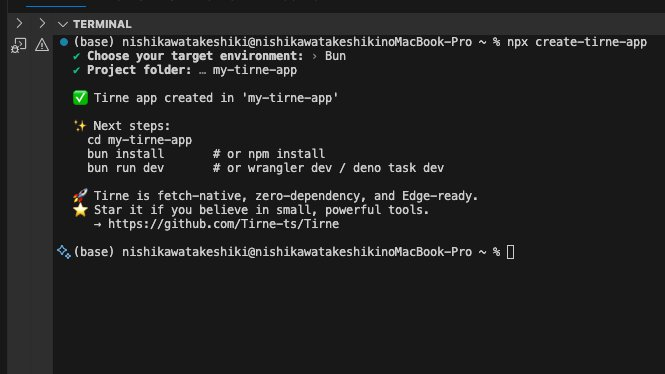

# create-tirne-app

> Scaffold blazing-fast, zero-boilerplate APIs across Bun, Deno, Workers, and Node — in seconds.
> Tirne is how Go would write backend in TypeScript.

---

## 🚀 Quickstart

```bash
npx create-tirne-app
```
<p align="center">  </p> `
Choose your environment:

* **Bun**
* **Deno**
* **Cloudflare Workers**
* **Netlify Edge Functions**

This command sets up a ready-to-run Tirne project in seconds.

---

## 📁 What You Get

A zero-boilerplate project, tailored for your runtime:

* `index.ts` with a working router and a `/` endpoint
* Runtime config files (`bunfig.toml`, `deno.json`, `wrangler.toml`)
* `package.json` with minimal scripts and dependencies

Example output:

```bash
✔ Choose your target environment: › Bun
✔ Project folder: › my-tirne-app

✅ Tirne app created in 'my-tirne-app'

Next steps:

  cd my-tirne-app
  bun install       # or npm install
  bun run dev       # or wrangler dev / deno task dev
```

---

## 🌐 Why Tirne?

Tirne isn’t another framework. It’s a **code-first philosophy**:

* 🧱 **No classes. No magic. Just functions.**
  Everything visible, understandable. If it can’t be written in five lines, it probably shouldn’t exist.

* ⚡ **Zero startup, zero lock-in, zero boilerplate.**
  Start small, stay lean. No CLI ceremony or forced structure.

* 🧠 **Go-style backend, TypeScript-native.**
  Explicit error handling, structured parallelism, full fetch compatibility.

* 🌍 **Run anywhere.**
  Bun, Deno, Node, Workers — all supported via `fetch()` API.

If you're tired of macros, decorators, and overengineered abstractions — welcome home.

---

## 🧱 Template Variants

* `bun-tirne/` — Bun-native
* `deno-tirne/` — Deno + `deno task`
* `netlify-tirne/` — Netlify Edge Functions
* `workers-tirne/` — Cloudflare Workers

Each variant includes a single-entry `index.ts` tailored to its runtime.

---

## 📦 Install Globally (Optional)

```bash
npm install -g create-tirne-app
```

Then run:

```bash
create-tirne-app
```

---

## 📣 Join the Movement

Tirne is fast, typed, fetch-native, and ready to scale with you. It’s not Express 3.0. It’s a new way to think about APIs.

👉 Star Tirne on GitHub and help shape a future built on control, clarity, and code.

[https://github.com/Tirne-ts/Tirne](https://github.com/Tirne-ts/Tirne)

---

## 📜 License

MIT
